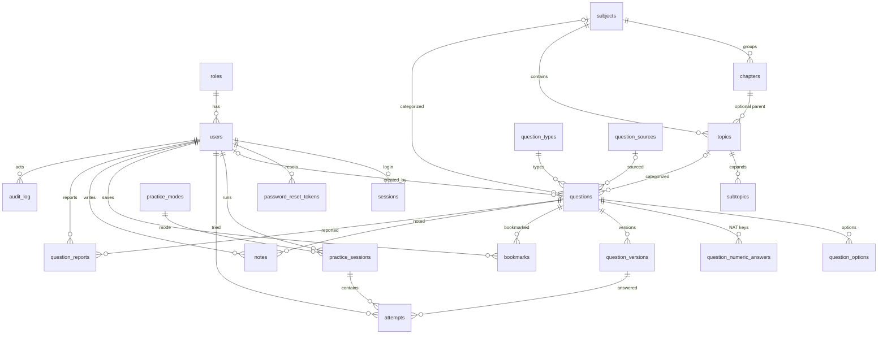

# PHASE 3 — DATABASE & DATA MODEL DESIGN
## GATE CS & IT PYQ Practice Platform

> **Source of truth:** Approved Phase 0 (Discovery) + Phase 1 (PRD) + Phase 2 (IA/Flow).
> **Non-negotiable scope:** design only — no application code, no DB files, no migrations, no packages installed.
> **Referred IDs:** FR-xxx (PRD §2), PM-xxxx (PRD §4.1), MA-xxx (PRD §5), OD-xx (PRD §12), UXD-xx (Phase 2), PG-/ADM- (Phase 2 §5).
> **Target DB:** PostgreSQL 14+ (this design assumes PG15 feature set; uses publicly available PostgreSQL types only: `uuid`, `text`, `numeric`, `jsonb`, `inet`, `timestamptz`, etc.).

---

## 1. Database Design Summary

A single-tenant PostgreSQL relational model where **attempts are the central fact table**. Every question a student solves in a session is an immutable `attempts` row that captures the exact **question version** seen, the selected answers, time taken, and scoring — so any past session can be reconstructed and all analytics (accuracy, subject/topic/difficulty/type breakdowns, weak topics, recommendations) are **derived by query, not pre-aggregated**. Content (subjects → chapters → topics → subtopics) is a data-driven hierarchy with optional middle levels (OD-04 default: 2-level Subject→Topic). Questions support MCQ/MSQ/NAT through a polymorphic-but-typed design: options carry `is_correct` flags (MCQ/MSQ) and NAT answers live in a dedicated numeric-answer table with tolerance and units. Question edits are versioned via immutable `question_versions` snapshots so **history never breaks**. Student data (bookmarks, notes, attempts) is isolated per `user_id`; admin accountability is served by an append-only `audit_log`. The model is intentionally conservative: no stored derived aggregates (compute at read), a small optional cache for hot dashboard aggregates flagged for later.

Traceability: every table maps to a PRD requirement (§ indicated per table in the Entity List).

---

## 2. Schema Naming Conventions

| Rule | Convention | Example |
|---|---|---|
| Table names | lowercase plural, snake_case | `practice_sessions`, `question_versions` |
| Column names | lowercase snake_case | `time_taken_seconds` |
| Primary key | `id` (uuid) on business entities | `questions.id` |
| Foreign key | `<referenced_table_singular>_id` | `question_id`, `user_id` |
| Join table | `a_<b>` ordering by table | `question_tags` |
| Index | `ix_<table>_<cols>` | `ix_attempts_user_id_created_at` |
| Unique constraint | `uq_<table>_<cols>` | `uq_users_email` |
| Foreign key constraint | `fk_<child>_<parent>` | `fk_attempts_question_versions` |
| Check constraint | `ck_<table>_<col>` | `ck_questions_gate_year_pos` |
| Primary key name | `pk_<table>` | `pk_questions` |

---

## 3. Assumptions (multi-tenant / scope)

- **Single-tenant**: one platform instance serves all users (PRD §1.2; no multi-org concept stated). All tables carry `user_id`/`created_by` at row level; no tenant discriminator.
- **Guest trial is non-persistent** (FR-AUTH-04 / OD-02): guest attempts are **not written** to `attempts`; they live only in the transient web session. When a guest registers, no history to migrate (per default OD-02).
- **Taxonomy MVP depth = 2** (Subject→Topic) per OD-04. `chapters` and `subtopics` tables are **included for Future** and are optional (nullable FK) so the model is forward-compatible without a redesign.
- **One role per user** for MVP (Student/Moderator/Admin), per PRD §1.
- **Difficulty** fixed set (Easy/Medium/Hard) modeled as enum; assumed stable.

---

## 4. Entity List

> Each entity explains purpose, why it exists, key fields, and PRD/UX traceability.

### 4.1 Users & Access
| Entity | Purpose | Why it exists | Key fields | Traceability |
|---|---|---|---|---|
| `users` | Registered accounts (Student/Moderator/Admin) | Central identity; owns all student data; RBAC | id, email, password_hash, role_id, status, target_subject_id, timestamps | FR-AUTH-01..07; PRD §1 |
| `roles` | Role lookup (student/moderator/admin) | Extensible role model without schema change | id, code, name, is_active | PRD §1.1 |
| `sessions` | Auth session management | Secure logout/session expiry | id, user_id, token_hash, expires_at, revoked_at | FR-AUTH-02/03 |
| `password_reset_tokens` | Password recovery | Verified reset flow | id, user_id, token_hash, expires_at, used_at | FR-AUTH-05 (Should) |

### 4.2 Academic structure (taxonomy)
| Entity | Purpose | Why it exists | Key fields | Traceability |
|---|---|---|---|---|
| `subjects` | Top-level GATE subjects | Navigation, subject-wise practice (PM-SUBJ), subject analytics | id, code, name, sort_order, is_active, deleted_at | FR-SUBJ-01/02, FR-ADM-07 |
| `chapters` | Optional middle grouping | Future expansion; data-driven | id, subject_id, name, sort_order | FR-ADM-07 (Future) |
| `topics` | Topic within subject/chapter | Core drill target (PM-TOPIC), weak-topic analytics | id, subject_id (always), chapter_id (nullable), name | FR-TOPIC-01/02, MA-TTOP |
| `subtopics` | Optional fine-grained level | Future expansion | id, topic_id, subject_id, name | FR-ADM-07 (Future) |

### 4.3 Questions & content
| Entity | Purpose | Why it exists | Key fields | Traceability |
|---|---|---|---|---|
| `question_types` | Lookup (MCQ/MSQ/NAT + future) | Extensible question kind; drives grading behavior | id, code, name, has_options, has_numeric, supports_multiple | FR-EVAL-01..03, PRD §3 |
| `questions` | The live, mutable question row | Authorable current state; lifecycle; search/filter surface | id, question_type_id, body, explanation, marks, difficulty, status, version, subject/topic, year, source, created_by | FR-ADM-01..04, PRD §3 |
| `question_versions` | Immutable snapshots | Reconstruct any historical attempt exactly (version pinning) | id, question_id, version, snapshot(jsonb), created_by | FR-PERF-01; §9 decision |
| `question_options` | MCQ/MSQ options (live) | MCQ single / MSQ multi correct represented via is_correct flag | id, question_id, body, is_correct, sort_order | PRD §3 MCQ/MSQ |
| `question_numeric_answers` | NAT accepted numeric value(s)+tolerance | NAT graded to tolerance; multiple accepted values allowed | id, question_id, numeric_value, tolerance_abs, tolerance_rel, unit, precision | FR-EVAL-03, PRD §3 NAT |
| `question_sources` | Reference metadata / provenance | Year-wise practice (PM-YEAR) + copyright traceability | id, name, exam_year, paper_number, shift, is_active | Risk (content origin), FR-ADM-05 |

### 4.4 Practice
| Table | Purpose | Why it exists | Key fields | Traceability |
|---|---|---|---|---|
| `practice_modes` | Lookup (subject/topic/year/diff/mistake/custom) | Modes are data-driven | id, code, name | PRD §4.1 |
| `practice_sessions` | One practice run | Tracks session config, timing, status, lifecycle | id, user_id, mode_id, config(jsonb), timed, status, started_at/ended_at | FR-PRAC-01..07, FR-TIME |
| `attempts` | **Fact table**: one row per question per session | Reconstruct answer + grade + time; source of all analytics | id, session_id, user_id, question_version_id, sequence, selected_answers(jsonb), is_correct, marks, time_taken_seconds, answered_at | FR-PERF-01/02, MA-* |

### 4.5 Student features
| Entity | Purpose | Why it exists | Key fields | Traceability |
|---|---|---|---|---|
| `bookmarks` | Save questions | user-scoped list | id, user_id, question_id, created_at | FR-BMARK-01/02 |
| `notes` | Personal notes per question | user-specific, does not touch global content | id, user_id, question_id, body, updated_at | FR-NOTE-01/02 (Future) |

### 4.6 Content administration
| Entity | Purpose | Why it exists | Key fields | Traceability |
|---|---|---|---|---|
| `question_reports` | Student error reports | quality loop (Moderator queue) | question_id, reporter_user_id, reason, status, resolution | FR-QREP-01/02 (Should) |
| `audit_log` | Admin accountability & provenance | Monitor content/user changes, append-only | id, actor_id, action, entity_type, entity_id, before/after, created_at | FR-ADM-09 |
| (optional) `topic_stats_cache` | Derived dashboard aggregate (see §8) | only if needed under load | topic_id, user_id, attempts, correct, ... | MA-TTOP/MA-WEAK |

---

## 5. ER Diagram

**Cardinality legend:** `|o--o{` = zero-or-many-to-one; `||--o{` = one-to-many (required parent).

---

## 6. Table Definitions

> Column type names are PostgreSQL. `?` = nullable. CHECK/UNIQUE are described per-column here and consolidated in §7.

### 6.1 `roles`
| Column | Type | Nullable | Default | Key | Description |
|---|---|---|---|---|---|
| id | uuid | no | gen | PK | surrogate id |
| code | text | no | — | UQ | `student`\|`moderator`\|`admin` |
| name | text | no | — | — | display name |
| is_active | boolean | no | true | — | soft-disable role |

### 6.2 `users`
| Column | Type | Nullable | Default | Key | Description |
|---|---|---|---|---|---|
| id | uuid | no | gen | PK | surrogate id |
| email | citext | no | — | UQ | lowercase-canonical login; FR-AUTH-01 |
| password_hash | text | no | — | — | PBKDF2/argon2 digest; FR-AUTH-01 |
| role_id | uuid | no | (student) | FK roles | RBAC; PRD §1 |
| full_name | text | no | — | — | FR-AUTH-06 |
| status | text | no | 'active' | — | active\|disabled (FR-ADM-08) |
| target_subject_id | uuid | yes | — | FK subjects | onboarding focus (FR-AUTH-06) |
| email_verified_at | timestamptz | yes | — | — | email verification (FR-AUTH-01) |
| created_at | timestamptz | no | now | — | — |
| updated_at | timestamptz | no | now | — | — |
| deleted_at | timestamptz | yes | — | — | soft delete (FR-AUTH-07 Future) |

### 6.3 `sessions`
| Column | Type | Nullable | Default | Key | Description |
|---|---|---|---|---|---|
| id | uuid | no | gen | PK | — |
| user_id | uuid | no | — | FK users | owner; FR-AUTH-02/03 |
| token_hash | text | no | — | UQ | server-side session |
| ip | inet | yes | — | — | audit context |
| expires_at | timestamptz | no | — | — | sliding/long expiry |
| revoked_at | timestamptz | yes | — | — | explicit logout |

### 6.4 `password_reset_tokens`
| Column | Type | Nullable | Default | Key | Description |
|---|---|---|---|---|---|
| id | uuid | no | gen | PK | — |
| user_id | uuid | no | — | FK users | FR-AUTH-05 |
| token_hash | text | no | — | UQ | hashed one-time |
| expires_at | timestamptz | no | — | — | TTL |
| used_at | timestamptz | yes | — | — | one-time guard |

### 6.5 `subjects`
| Column | Type | Nullable | Default | Key | Description |
|---|---|---|---|---|---|
| id | uuid | no | gen | PK | FR-SUBJ |
| code | text | no | — | UQ | e.g. `algorithms` |
| name | text | no | — | UQ | display |
| sort_order | int | no | 0 | — | nav order |
| is_active | boolean | no | true | — | publish gate |
| deleted_at | timestamptz | yes | — | — | soft delete (prevent FK orphans) |

### 6.6 `chapters` (Future)
| Column | Type | Nullable | Default | Key | Description |
|---|---|---|---|---|---|
| id | uuid | no | gen | PK | — |
| subject_id | uuid | no | — | FK subjects | parent |
| name | text | no | — | — | — |
| sort_order | int | no | 0 | — | — |

### 6.7 `topics`
| Column | Type | Nullable | Default | Key | Description |
|---|---|---|---|---|---|
| id | uuid | no | gen | PK | FR-TOPIC |
| subject_id | uuid | no | — | FK subjects | always set (OD-04) |
| chapter_id | uuid | yes | — | FK chapters | nullable Future |
| name | text | no | — | — | — |
| sort_order | int | no | 0 | — | — |
| is_active | boolean | no | true | — | — |

### 6.8 `subtopics` (Future)
| Column | Type | Nullable | Default | Key | Description |
|---|---|---|---|---|---|
| id | uuid | no | gen | PK | — |
| topic_id | uuid | no | — | FK topics | parent |
| subject_id | uuid | no | — | FK subjects | denormalized for filter perf |
| name | text | no | — | — | — |

---

### 6.9 `question_types`
| Column | Type | Nullable | Default | Key | Description |
|---|---|---|---|---|---|
| id | uuid | no | gen | PK | PRD §3 |
| code | text | no | — | UQ | `mcq`\|`msq`\|`nat` (+future) |
| name | text | no | — | — | display |
| has_options | boolean | no | — | — | MCQ/MSQ true |
| has_numeric | boolean | no | — | — | NAT true |
| supports_multiple | boolean | no | — | — | MSQ true |

### 6.10 `questions`
| Column | Type | Nullable | Default | Key | Description |
|---|---|---|---|---|---|
| id | uuid | no | gen | PK | PRD §3, FR-ADM-01..04 |
| question_type_id | uuid | no | — | FK question_types | type drives grading |
| subject_id | uuid | no | — | FK subjects | taxonomy (FR-SUBJ, PM-SUBJ) |
| topic_id | uuid | yes | — | FK topics | taxonomy (FR-TOPIC, PM-TOPIC) |
| body | text | no | — | — | question text (may be long) |
| explanation | text | yes | — | — | FR-EXPL-01 |
| marks | numeric(4,1) | no | 1 | — | GATE mark value |
| negative_marks | numeric(4,1) | yes | 0 | — | negative policy (OD-01) |
| difficulty | text | no | 'medium' | — | easy\|medium\|hard (check) |
| status | text | no | 'draft' | — | draft\|in_review\|published\|rejected\|archived |
| version | int | no | 1 | — | current published version # |
| gate_year | int | no | — | — | year-wise filter (PM-YEAR) |
| source_id | uuid | yes | — | FK question_sources | provenance |
| created_by | uuid | no | — | FK users | author (FR-ADM-01) |
| reviewed_by | uuid | yes | — | FK users | last reviewer (FR-ADM-03, OD-07) |
| created_at | timestamptz | no | now | — | — |
| updated_at | timestamptz | no | now | — | — |

### 6.11 `question_versions`
| Column | Type | Nullable | Default | Key | Description |
|---|---|---|---|---|---|
| id | uuid | no | gen | PK | immutable snapshot id |
| question_id | uuid | no | — | FK questions | parent |
| version | int | no | — | UQ(question_id,version) | monotone |
| snapshot | jsonb | no | — | — | full question+options+answers as rendered, frozen |
| reason | text | yes | — | — | why version changed |
| created_by | uuid | no | — | FK users | author of snapshot |
| created_at | timestamptz | no | now | — | — |

### 6.12 `question_options`
| Column | Type | Nullable | Default | Key | Description |
|---|---|---|---|---|---|
| id | uuid | no | gen | PK | PRD §3 MCQ/MSQ |
| question_id | uuid | no | — | FK questions | parent (live) |
| body | text | no | — | — | option text |
| is_correct | boolean | no | false | — | MCQ: exactly 1 true; MSQ: >=1 |
| sort_order | int | no | — | — | render order (before seed shuffle) |

### 6.13 `question_numeric_answers`
| Column | Type | Nullable | Default | Key | Description |
|---|---|---|---|---|---|
| id | uuid | no | gen | PK | PRD §3 NAT |
| question_id | uuid | no | — | FK questions | parent |
| numeric_value | numeric(20,8) | no | — | — | canonical value |
| tolerance_abs | numeric(20,8) | yes | 0 | — | absolute epsilon (OD-03) |
| tolerance_rel | numeric(5,4) | yes | 0 | — | relative epsilon |
| unit | text | yes | — | — | optional unit (case-insensitive compare) |
| precision | int | yes | — | — | display precision; grading uses tolerance, not precision |

### 6.14 `question_sources`
| Column | Type | Nullable | Default | Key | Description |
|---|---|---|---|---|---|
| id | uuid | no | gen | PK | provenance (Risk: lic) |
| name | text | no | — | UQ | e.g. "GATE 2023 CS Paper" |
| exam_year | int | no | — | — | — |
| paper_number | text | yes | — | — | shift/set |
| shift | text | yes | — | — | — |
| is_active | boolean | no | true | — | — |

---

### 6.15 `practice_modes`
| Column | Type | Nullable | Default | Key | Description |
|---|---|---|---|---|---|
| id | uuid | no | gen | PK | PRD §4.1 |
| code | text | no | — | UQ | subject\|topic\|year\|difficulty\|mistake\|custom |
| name | text | no | — | — | display |

### 6.16 `practice_sessions`
| Column | Type | Nullable | Default | Key | Description |
|---|---|---|---|---|---|
| id | uuid | no | gen | PK | FR-PRAC-01..07 |
| user_id | uuid | no | — | FK users | owner (per-user isolation) |
| mode_id | uuid | no | — | FK practice_modes | which mode |
| config | jsonb | no | '{}' | — | filters: subject/topic/year/difficulty/custom |
| timed | boolean | no | false | — | FR-TIME-01; UXD-03 default untimed |
| total_questions | int | no | — | — | pool size |
| status | text | no | 'in_progress' | — | in_progress\|submitted\|completed\|abandoned |
| started_at | timestamptz | no | now | — | — |
| ended_at | timestamptz | yes | — | — | submit/abandon time |
| abandoned_at | timestamptz | yes | — | — | 24h resume window (Phase 2) |
| score | numeric(8,2) | yes | — | — | computed at submit |

### 6.17 `attempts` (fact)
| Column | Type | Nullable | Default | Key | Description |
|---|---|---|---|---|---|
| id | uuid | no | gen | PK | FR-PERF-01/02 |
| session_id | uuid | no | — | FK practice_sessions | container |
| user_id | uuid | no | — | FK users | owner (denormalized for analytics) |
| question_version_id | uuid | no | — | FK question_versions | exact frozen question seen |
| sequence | int | no | — | — | order in session (FR-PRAC-02) |
| selected_answers | jsonb | no | — | — | for MCQ: option ids; MSQ: option id array; NAT: numeric string + unit |
| is_correct | boolean | no | — | — | grading result |
| marks | numeric(6,2) | no | 0 | — | +ve or negative (OD-01) |
| time_taken_seconds | int | no | — | — | per-question timer (FR-TIME-01) |
| answered_at | timestamptz | no | now | — | — |
| response_version | int | no | 1 | — | invariant sync guard |

### 6.18 `bookmarks`
| Column | Type | Nullable | Default | Key | Description |
|---|---|---|---|---|---|
| id | uuid | no | gen | PK | FR-BMARK-01/02 |
| user_id | uuid | no | — | FK users | owner |
| question_id | uuid | no | — | FK questions | target |
| created_at | timestamptz | no | now | — | — |

### 6.19 `notes` (Future)
| Column | Type | Nullable | Default | Key | Description |
|---|---|---|---|---|---|
| id | uuid | no | gen | PK | FR-NOTE-01/02 |
| user_id | uuid | no | — | FK users | owner |
| question_id | uuid | no | — | FK questions | target |
| body | text | no | — | — | markdown note |
| created_at | timestamptz | no | now | — | — |
| updated_at | timestamptz | no | now | — | — |

### 6.20 `question_reports`
| Column | Type | Nullable | Default | Key | Description |
|---|---|---|---|---|---|
| id | uuid | no | gen | PK | FR-QREP-01/02 |
| question_id | uuid | no | — | FK questions | target |
| reporter_user_id | uuid | no | — | FK users | who flagged |
| reason | text | no | — | — | typo / ambiguous / wrong answer |
| detail | text | yes | — | — | free text |
| status | text | no | 'open' | — | open\|reviewed\|resolved\|dismissed |
| resolution | text | yes | — | — | moderator note |
| created_at | timestamptz | no | now | — | — |

### 6.21 `audit_log` (append-only)
| Column | Type | Nullable | Default | Key | Description |
|---|---|---|---|---|---|
| id | bigint | no | identity | PK | monotonic |
| actor_id | uuid | no | — | FK users | who (FR-ADM-09) |
| action | text | no | — | — | e.g. question.create / review.publish |
| entity_type | text | no | — | — | questions\|topics\|subjects\|users |
| entity_id | uuid | no | — | — | affected row |
| before | jsonb | yes | — | — | prior state (for edits) |
| after | jsonb | yes | — | — | new state |
| created_at | timestamptz | no | now | — | — |

---

## 7. Relationships

### 7.1 One-to-many (parent → child)
| Parent | Child | FK column | ON DELETE | ON UPDATE | Purpose |
|---|---|---|---|---|---|
| roles | users | users.role_id | RESTRICT | CASCADE | assign role |
| users | sessions | sessions.user_id | CASCADE | — | session cleanup with user |
| users | password_reset_tokens | password_reset_tokens.user_id | CASCADE | — | tokens die with user |
| subjects | chapters | chapters.subject_id | RESTRICT | CASCADE | taxonomy |
| subjects | topics | topics.subject_id | RESTRICT | CASCADE | taxonomy |
| chapters | topics | topics.chapter_id (nullable) | NO ACTION | CASCADE | optional grouping |
| topics | subtopics | subtopics.topic_id | RESTRICT | CASCADE | hierarchy |
| question_types | questions | questions.question_type_id | RESTRICT | CASCADE | type lookup |
| subjects → questions | questions.subject_id | RESTRICT | CASCADE | classify |
| topics → questions | questions.topic_id | RESTRICT | CASCADE | classify |
| question_sources → questions | questions.source_id | RESTRICT | CASCADE | provenance |
| questions | question_versions | question_versions.question_id | RESTRICT | CASCADE | version chain |
| questions | question_options | question_options.question_id | RESTRICT | CASCADE | options |
| questions | question_numeric_answers | question_numeric_answers.question_id | RESTRICT | CASCADE | NAT keys |
| users | practice_sessions | practice_sessions.user_id | RESTRICT | RESTRICT | owner isolation |
| practice_modes | practice_sessions | practice_sessions.mode_id | RESTRICT | CASCADE | mode |
| practice_sessions | attempts | attempts.session_id | RESTRICT | RESTRICT | session facts |
| users → attempts | attempts.user_id | RESTRICT | RESTRICT | owner |
| question_versions → attempts | attempts.question_version_id | RESTRICT | RESTRICT | frozen question |
| users | bookmarks | bookmarks.user_id | RESTRICT | RESTRICT | owner |
| questions | bookmarks | bookmarks.question_id | CASCADE | CASCADE | bookmark die with Q |
| users | notes | notes.user_id | RESTRICT | RESTRICT | owner |
| users | question_reports | question_reports.reporter_user_id | RESTRICT | RESTRICT | reporter |
| users | audit_log | audit_log.actor_id | RESTRICT | RESTRICT | actor snapshot |

### 7.2 Many-to-one / effective many-to-many
No explicit many-to-many join is required in MVP; question-to-topic is one-to-one (single topic). If a question must later belong to multiple topics, split into `question_topic` join table (Future). Considered, deferred.

### 7.3 Referential action policy
- **Audit + history are never destroyed**: `attempts`, `question_versions`, `audit_log` use RESTRICT on parent deletes.
- **Content taxonomy** uses RESTRICT so you cannot delete a subject/topic that still has questions (prevents orphans).
- **User-owned data** (sessions, tokens) cascade delete with the user.
- **Hard question delete** is blocked (CASCADE on bookmarks), so content changes go through versioning/archive, never physical delete while referenced.

---

## 8. Constraints

| Type | Example | Prevents |
|---|---|---|
| PK `pk_<table>` | every table | guarantees a row identity |
| FK `fk_<child>_<parent>` | all FKs above | orphan rows / broken refs |
| UQ `uq_users_email` | users.email | duplicate accounts (FR-AUTH-01) |
| UQ `uq_question_versions_question_id_version` | version uniqueness per question | two snapshots with same version |
| UQ `uq_subjects_code`, `uq_subjects_name` | duplicate subject | taxonomy confusion |
| UQ `uq_bookmarks_user_question` | (user_id, question_id) | duplicate bookmark |
| NOT NULL | all required columns | missing mandatory data |
| CK `ck_questions_difficulty` | difficulty IN (easy,medium,hard) | invalid difficulty |
| CK `ck_questions_status` | status IN (draft,in_review,...) | invalid lifecycle |
| CK `ck_questions_gate_year_pos` | gate_year > 1990 | bogus year |
| CK `ck_questions_onepositive` | (question_type = NAT AND exactly 1... ) → enforced app-side | invalid shape |
| CK `ck_attempts_marks_nonneg` | marks >= -abs(marks) (managed app-side sign) | scoring corruption |
| CK `ck_practice_sessions_total_pos` | total_questions > 0 | empty session |

> Several cross-table invariants (e.g., "MCQ has exactly one correct option") cannot be expressed as a single-column CHECK; they are enforced by content-creation transaction + app validation (documented in §8 / §9).

---

## 9. Indexing Strategy

> Indexes are recommended only where they serve a real query pattern; nothing speculative.

| Index | Columns | Supports | Why |
|---|---|---|---|
| `ix_users_email` (unique) | users.email | login lookup | auth hot path |
| `ix_sessions_user_id` | sessions.user_id | active sessions per user | logout/cleanup |
| `ix_attempts_user_id_answered_at` | attempts(user_id, answered_at) | per-user history + trends (MA-TRND) | analytics |
| `ix_attempts_question_version_id` | attempts.question_version_id | reconcile attempts→question | joins |
| `ix_attempts_session_id` | attempts.session_id | rebuild a session (FR-PERF) | reconstruction |
| `ix_questions_status_published_topic` | questions(status, topic_id, gate_year) | pool building for practice filters (FR-PRAC, PM-*) | session setup |
| `ix_questions_subject_status` | questions(subject_id, status) | subject browse counts (FR-SUBJ-02) | counts |
| `ix_topics_subject_id` | topics(subject_id) | topic drill (FR-TOPIC) | navigation |
| `ix_question_options_question_id` | question_options(question_id) | options fetch | render |
| `ix_question_versions_question_id` | question_versions(question_id) | version chain | history |
| `ix_audit_log_entity_type_entity_id` | audit_log(entity_type, entity_id) | per-entity audit drilldown | admin |
| `ix_question_reports_status` | question_reports(status) | moderator queue | review |

**Deferred / avoid now:**
- No index on `attempts.selected_answers` (JSONB) — only read by exact session rebuild; querying inside JSON is rare.
- Do **not** index every `updated_at`; low query value.
- GIN on `questions.body` only when search feature (Future) is added; a plain btree on body is premature.

---

## 10. Data Integrity

| Concern | How prevented |
|---|---|
| Duplicate questions | unique source+year+shift+index within `question_sources` + app normalization at import; rely on `id` PK |
| Invalid question types | FK to `question_types` + `question_type_id` required; CHECK not needed since lookup is the gate |
| Invalid answers | NAT keys live in `question_numeric_answers` (numeric CHECK); MCQ sole-correct / MSQ ≥1 enforced in content write transaction (single-writer row lock) |
| Orphan records | FK RESTRICT + ON DELETE policy (§7.3); no delete of referenced taxonomy/history |
| Unauthorized ownership | all user-scoped tables carry `user_id`; auth middleware + row-level scoping in API (§12); `attempts/user_id` must equal session owner (invariant) |
| Inconsistent hierarchy | subjects required for topics (NOT NULL); chapter nullable but must match subject if set (app cross-check); optional subtopics |
| Concurrent-edit corruption | optimistic concurrency: `questions.version` incremented in transaction; question_versions appended atomically; attempts store `question_version_id` |

---

## 11. Analytics Strategy

### 11.1 Source data (stored once, never derived)
`attempts` is the single source of truth: `is_correct`, `marks`, `time_taken_seconds`, `question_version_id`, `answered_at`, plus the current question's subject/topic/difficulty/type reachable via `question_versions.snapshot` or the current `questions` row. `practice_sessions` adds temporal grouping + mode.

### 11.2 Derivable metrics (compute on read — no storage)
| Metric | Derivation |
|---|---|
| Overall accuracy (MA-ACC) | `AVG(is_correct)` over attempts of user |
| Total attempts (MA-TATT) | `COUNT(*)` |
| Topic accuracy (MA-TTOP) | group attempts by question.topic_id |
| Difficulty accuracy (MA-DIFF) | group by snapshot difficulty |
| Type accuracy | group by question_type |
| Average time | `AVG(time_taken_seconds)` |
| Mistake rate (MA-MIST) | wrong / total (per topic) |
| Streak (MA-STRK) | distinct session days |
| Trend (MA-TRND) | sliding time-bucket accuracy |

These are simple aggregate queries over the indexed attempt columns; **do not store** them for MVP.

### 11.3 Candidate materialization (Future / when hot)
- `topic_stats_cache` (user_id, topic_id, attempts, correct, last_session_at) refreshed per session-end — only if the dashboard aggregates exceed ~100ms p95 at scale.
- Weekly rollups: partition-friendly `attempts_daily` if retention analysis queries grow heavy.
- **Reason to defer:** correct-on-read guarantees consistency, avoids invalidation bugs; add cache only when measured need appears.

### 11.4 Weak-topic detection & recommendations
- **Weak topics (MA-WEAK):** per user+topic compute accuracy + attempt count; flag if accuracy < threshold AND attempts >= min (OD-05 default: <45% and ≥5). Pure SQL over attempts joined to question_versions.
- **Recommendation (MA-REC / FR-REC):** rank flagged topics by (1−accuracy), weighted by recency (time-decay on last attempt) — computed in query, one-click session prefill reads `practice_sessions.config` template.

> Because attempts stores `question_version_id`, even a question re-tagged to a new topic later still aggregates under the **topic that sat student** at attempt time (snapshot), keeping history/trends truthful.

---

## 12. Scalability Considerations

| Dimension | Design support |
|---|---|
| Thousands of questions | `questions` flat, indexed on (status, topic, year); options/answers in small child tables; pool building is a single filtered SELECT |
| Large attempt scale | attempts append-only; per-user queries bounded by `ix_attempts_user_id_answered_at`; history kept, no rebuild |
| Multiple GATE years + question types | data-driven `question_types` + `question_sources.exam_year`; no schema change for new year/shift/type |
| More users | index-friendly; no cross-user aggregates at MVP; per-user partition target for Future `attempts` |
| Mock tests (Future) | reuse `practice_sessions` with `mode=exam` + a future `exam_set` table; attempts + grading identical — no redesign |
| Horizontal read scale (only when needed) | PG read replica for dashboards; not required at MVP scale (avoid over-engineering) |
| Partitioning | not needed at MVP; if attempts > ~100M rows, partition `attempts` by `answered_at` (date range), `ix_attempts_user_id_answered_at` remains effective |

---

## 13. Design Decisions & Trade-offs

> Each: Decision → Reason → Trade-off.

1. **UUID vs auto-increment IDs** → **UUID (v7-gen)**: collision-safe across imports/bulk loads, no enumeration bugs, clean merges; trade-off: 16-byte keys + slightly larger indexes — negligible at this scale.
2. **Enum vs lookup tables** — enums for *stable fixed* values (difficulty, status), **lookup tables** for extensible sets (`roles`, `question_types`, `practice_modes`) → Reason: a new question type or role must not require DDL; trade-off: one extra join for the extensible values.
3. **JSON/JSONB vs normalized columns** → **normalized columns for graded facts** (`is_correct`, `marks`, timing) and **JSONB only for flexible payloads** (session `config`, version `snapshot`, attempt `selected_answers`): reason — analytics queryability + version freeze; trade-off: JSONB is less validated (mitigated by app-level validation + snapshot immutability).
4. **Soft delete vs hard delete** — **soft delete** (`deleted_at`) for users/subjects; questions go to `archived` status; attempts/audit permanent. Reason: retention, GDPR right-to-delete (FR-AUTH-07 Future) + audit integrity; trade-off: queries must filter `deleted_at IS NULL`.
5. **Storing correct answers** — **options hold `is_correct`; NAT values normalized** in `question_numeric_answers`; each snapshot embeds them. Never store the secret raw in `questions`; grading computed from the version snapshot.
6. **Options as separate table vs JSONB** — **separate `question_options` table**: reason: FK integrity, per-option sort, future re-ordering, aggregation; trade-off: more joins than a single JSON blob.
7. **NAT answers (range/tolerance/units)** — `question_numeric_answers` with `numeric_value`, `tolerance_abs` + `tolerance_rel`, optional `unit`, integer `precision`: reason — GATE numeric answers are exact-with-tolerance, not intervals; multiple keys allowed. Trade-off: relative tolerance kept explicit (no implicit rounding rule).
8. **MSQ multiple correct** — one option set per question with `is_correct` per option; grading = exact-set match (full) else partial per OD-03. Trade-off: app computes set equality; DB enforces per-option shape, not the whole set.
9. **Question versioning** — every publish bumps `questions.version` and appends an immutable `question_versions.snapshot(jsonb)`; attempts reference the snapshot id, so historical attempts never change when content is corrected. Reason: FR-PERF-01 reconstruction; trade-off: snapshot blobs add storage (small; JSON).
10. **Question source metadata** — `question_sources` (name, exam_year, paper_number, shift) as a referenced table; reason: year-wise practice (PM-YEAR) + licensing provenance; trade-off: one extra join per question (indexed).

---

## 14. Additional Requirements

### 14.1 Security & Data Ownership Rules
- **Row-level isolation**: all per-user tables (`attempts`, `sessions`, `bookmarks`, `notes`, `practice_sessions`) are scoped by `user_id`; API resolves `user_id` from the authenticated session, never from the request body (prevents IDOR).
- **RBAC** enforced server-side (FR-AUTH-02/03, PRD §1.2); `roles` lookup; admin/moderation capabilities gated by role.
- **Secrets**: password `PBKDF2`/`argon2id`; session/reset tokens stored hashed; no plaintext.
- **Guest** never reaches `attempts`/notes/bookmarks (OD-02).

### 14.2 Audit Logging
`audit_log` append-only (only INSERT permitted); trail: who/what/when + before/after JSON for content edits; never update/delete; indexes on (entity_type, entity_id) + actor_id for admin drilldown (FR-ADM-09).

### 14.3 Data Retention Policy (Open Decision DB-R)
Default proposal: keep **raw attempt data for the student's public exam history**, but remove PII-adjacent columns on account deletion (FR-AUTH-07 Future) and provide an export. Given Indian DPDP (privacy) compliance, mark as **Open Decision DB-R**: options — (a) keep forever / (b) delete raw attempts after 3 years / (c) anonymize after 2 years. Recommended default: (a) with export + delete-rights for the account-holder, until a legal decision.

### 14.4 Migration Strategy
- Apply **sequential versioned migrations** (e.g. `001_users.sql` …) with an `instrumentation` `schema_migrations` table; forward-only; wrap DDL in transactions where PG supports.
- **Additive-only** patterns (new nullable columns, new tables) first; then backfill; then add FK/check; rename via `create-new → fix refs → drop-old` to allow **no-downtime** rolling.
- Never edit an applied migration; append a new one.

---

## 15. Potential Problems & Risks

| Risk | Severity | Mitigation / Decision |
|---|---|---|
| **Big-INT / numeric precision** in NAT grading (OD-03) | Medium | Tolerance-based compare function applied in app layer; uncertainty confined to correctness of edge floats — add unit tests at Phase 5, not schema |
| **Question version snapshot bloat** | Low | Snapshot is compact JSON; version only on publish; archive old snapshots if needed |
| **MSQ set-equality grading correctness** | Medium | Single, shared grading service owns "exact-set → full / partial" logic; MVP risk — validate with a canonical test set before launch |
| **Retention/privacy (DB-R)** | Medium | Accept DPDP; implement export + right-to-delete before scale |
| **Concurrent content edits** | Low | `version` optimistic lock + transaction; conflict surfaced to admin |
| **Attempts must never leak between users** | High | `user_id` never taken from body; server sets from session; RLS policy in PG as defense-in-depth |
| **Guest trial abuse** | Low | non-persistent guest, no DB rows (OD-02), tight cap |

---

## 16. Open Decisions & Assumptions Log

| ID | Question | Options | Recommended Default | Impact if Unresolved |
|---|---|---|---|---|
| OD-01 | MCQ negative-marking policy | official / custom / none | GATE official | grading correctness (§13.5, attempts.marks) |
| OD-03 | MSQ partial + NAT tolerance | exact / partial; tolerance | full-on-exact; partial credit; tolerance ±0.1 (+ authored per-question) | grading + snapshot design |
| OD-04 | Taxonomy depth (chapters/subtopics) | 2-level; 3-4 level | 2-level, optional chapters/subtopics nullable | `chapters`/`subtopics` stay (Future) |
| OD-05 | Weak-topic threshold / min attempts | variants | acc < 45% AND attempts ≥ 5 | analytics query constants |
| OD-06 | Unanswered-at-submit policy | wrong / skipped / not scored | "skipped", not scored (age OD-06) | attempts.is_correct for skipped submissions |
| OD-02/UXD-08 | Guest trial persistence/volume | 5/10/15 Qs non-persist | 5 Qs non-persistent | if persisted → `guest_trials` table needed |
| DB-R | Data retention window (attempts) | forever / delete 3y / anonymize 2y | forever + export & delete-rights | retention jobs |

**Assumptions (recorded):** single-tenant (§3); one role per user; difficulty set fixed; taxonomy 2-level MVP; guest non-persistent; no multi-language columns (language field optional in question body only).

---

## 17. Final Recommended Schema (summary)

| Table | Purpose |
|---|---|
| `roles`, `users`, `sessions`, `password_reset_tokens` | Identity, auth, RBAC (FR-AUTH) |
| `subjects`, `chapters`, `topics`, `subtopics` | Data-driven academic hierarchy (FR-SUBJ/TOPIC, OD-04) |
| `question_types`, `questions`, `question_versions`, `question_options`, `question_numeric_answers`, `question_sources` | Content engine + immutable version snapshots (FR-ADM, PRD §3) |
| `practice_modes`, `practice_sessions`, `attempts` | Practice loop + observable attempt facts (FR-PRAC/PERF/TIME) |
| `bookmarks`, `notes`, `question_reports` | Student features + quality loop (FR-BMARK/NOTE/QREP) |
| `audit_log` | Admin accountability & governance (FR-ADM-09) |

---

## Validation Checklist (Phase 3)

- [x] Every **MVP requirement** from PRD has data support (FR-AUTH→users; FR-SUBJ/TOPIC→subjects/topics; FR-PRAC/TIME→sessions/attempts; FR-EVAL→types/options/numeric answers; FR-BMARK/NOTE→bookmarks/notes; FR-MIST→attempts; FR-DASH/REC→attempts+question_versions; FR-ADM→admin tables).
- [x] Every relationship has a valid FK + cardinality (§7 with ON DELETE/UPDATE).
- [x] No unnecessary duplication: facts normalized; source vs derived separated (§11).
- [x] Student isolation: all per-user rows carry `user_id` (bookmarks/notes/attempts/sessions) (§14.1).
- [x] MCQ/MSQ/NAT representable incl. edge cases: options+is_correct, tolerance+units+multiple keys (§6.12–13).
- [x] Attempts reconstructable: `question_version_id` + `selected_answers` snapshot (§6.17).
- [x] Analytics all derivable from source (no stored aggregates) (§11.2).
- [x] Future evolution (mock, more types, more years) without redesign (§12, question_types/question_sources).
- [x] Constraints + indexes justified (§8–9).
- [x] All Open Decisions logged with defaults (§16).

---

## End of Phase 3 — design only, nothing implemented. Next phase: Phase 4 (API Architecture & Backend Design) once approved.